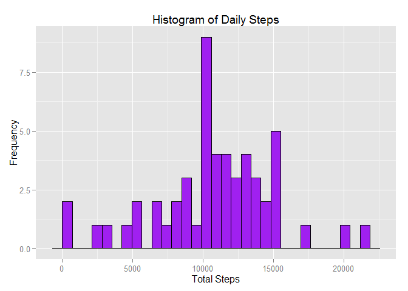
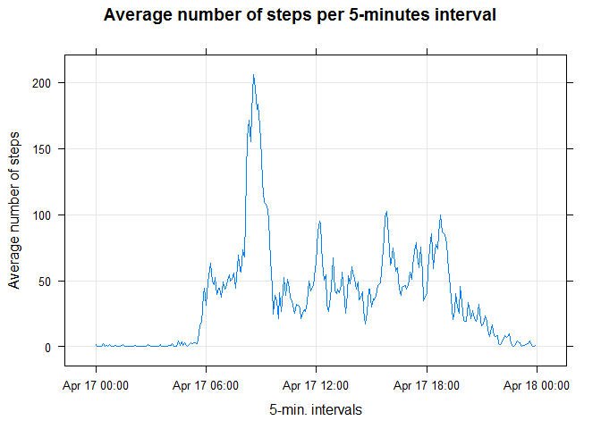
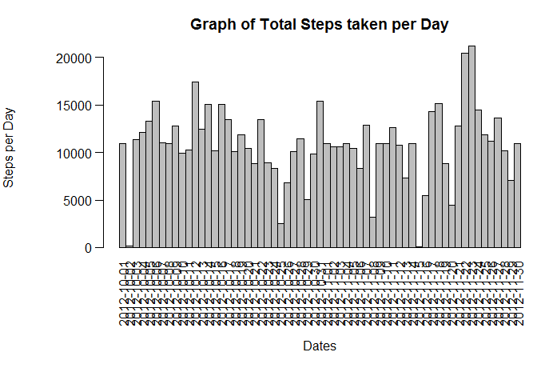

# Reproducible Research: Peer Assessment 1
Brian Lewis

## Loading and preprocessing the data
Show any code that is needed to:  

#### 1. Load the data (i.e. read.csv())  


```r
library(knitr)
opts_chunk$set(echo=TRUE)
data <- read.csv("activity.csv")
str(data)
```

```
## 'data.frame':	17568 obs. of  3 variables:
##  $ steps   : int  NA NA NA NA NA NA NA NA NA NA ...
##  $ date    : Factor w/ 61 levels "2012-10-01","2012-10-02",..: 1 1 1 1 1 1 1 1 1 1 ...
##  $ interval: int  0 5 10 15 20 25 30 35 40 45 ...
```

#### 2. Process/transform the data (if necessary) into a format suitable for your analysis

##### Create date.time field and repopulate time field to analyze time intervals and determine total steps 


```r
time <- formatC(data$interval/100, 2, format = "f")
data$date.time <- as.POSIXct(paste(data$date, time), format = "%Y-%m-%d %H.%M", 
    tz = "GMT")
data$time <- format(data$date.time, format = "%H:%M:%S")
data$time <- as.POSIXct(data$time, format = "%H:%M:%S")
newdata <- na.omit(data)
total.steps <- tapply(newdata$steps, newdata$date, sum)
```

## What is mean total number of steps taken per day?
For this part of the assignment, you can ignore the missing values in the dataset.

#### 1. Make a histogram of the total number of steps taken each day


```r
library(ggplot2)
qplot(total.steps, xlab = "Total Steps", ylab = "Frequency", main = "Histogram of Daily Steps") + geom_histogram(colour="black", fill="purple")
```

 

#### 2. Calculate and report the mean and median total number of steps taken per day


```r
datamean <- mean(total.steps, na.rm=TRUE)
print(datamean)
```

```
## [1] 10766.19
```

```r
datamedian <- median(total.steps, na.rm=TRUE)
print(datamedian)
```

```
## [1] 10765
```

### The mean number of total number of steps taken per day is **10,766**.
### The median number of total number of steps taken per day is **10,765**.

## What is the average daily activity pattern?

1.  Make a time series plot (i.e. type = "l") of the 5-minute interval (x-axis) and the average number of steps taken, averaged across all days (y-axis)

#### Calculate the mean steps for each five minute interval.


```r
mean.steps <- tapply(data$steps, data$time, mean, na.rm = TRUE)
daily.pattern <- data.frame(time = as.POSIXct(names(mean.steps)), mean.steps = mean.steps)
```

#### Produce time series plot for the mean steps.


```r
library(lattice)
xyplot(mean.steps ~ time, data=daily.pattern, type="l", grid=TRUE, ylab="Average number of steps", xlab="5-min. intervals", main="Average number of steps per 5-minutes interval")
```

 

2.  Which 5-minute interval, on average across all the days in the dataset, contains the maximum number of steps?


```r
highest <- which.max(daily.pattern$mean.steps)
format(daily.pattern[highest, "time"], format = "%H:%M")
```

```
## [1] "08:35"
```

### The 5-minute interval, on average across all the days in the dataset,that contains the maximum number of steps is **8:35**.

## Imputing missing values
Note that there are a number of days/intervals where there are missing values (coded as NA). The presence of missing days may introduce bias into some calculations or summaries of the data.

1.  Calculate and report the total number of missing values in the dataset (i.e. the total number of rows with NAs)


```r
sum(is.na(data$steps))
```

```
## [1] 2304
```

### The total number of missing values in the dataset (i.e. the total number of rows with NAs) is **2,304**.

2.  Devise a strategy for filling in all of the missing values in the dataset. The strategy does not need to be sophisticated. For example, you could use the mean/median for that day, or the mean for that 5-minute interval, etc.  

The average 5-minute interval values from the prevous section is used to replace the NA values of the original data and a new dataset will be generated.


```r
stepValues <- data.frame(data$steps)
stepValues[is.na(stepValues),] <- ceiling(tapply(X=data$steps,INDEX=data$interval,FUN=mean,na.rm=TRUE))
newData <- cbind(stepValues, data[,2:3])
colnames(newData) <- c("Steps", "Date", "Interval")
head(newData)
```

```
##   Steps       Date Interval
## 1     2 2012-10-01        0
## 2     1 2012-10-01        5
## 3     1 2012-10-01       10
## 4     1 2012-10-01       15
## 5     1 2012-10-01       20
## 6     3 2012-10-01       25
```

3.  Create a new dataset that is equal to the original dataset but with the missing data filled in.


```r
newDailyStepSum <- aggregate(newData$Steps, list(newData$Date), sum)
colnames(newDailyStepSum) <- c("Date", "Steps")
head(newDailyStepSum)
```

```
##         Date Steps
## 1 2012-10-01 10909
## 2 2012-10-02   126
## 3 2012-10-03 11352
## 4 2012-10-04 12116
## 5 2012-10-05 13294
## 6 2012-10-06 15420
```

4.  Make a histogram of the total number of steps taken each day and Calculate and report the mean and median total number of steps taken per day. Do these values differ from the estimates from the first part of the assignment? What is the impact of imputing missing data on the estimates of the total daily number of steps?  

#### Draw histogram of imputed dataset.


```r
with(newDailyStepSum, {
    par(oma=c(2,0,0,0), mar=c(6.75,6.75,3,0), mgp=c(5.75,0.75,0), las=2)
    barplot(
      height=Steps,
      main="Graph of Total Steps taken per Day",
      xlab="Dates",
      ylab="Steps per Day",
      names.arg=Date,
      space=c(0)
    )
})
```

 

#### Compare means and medians of original and imputed datasets.


```r
newDailyStepMean <- mean(newDailyStepSum$Steps)
print(newDailyStepMean)
```

```
## [1] 10784.92
```

```r
newDailyStepMedian <- median(newDailyStepSum$Steps)
print(newDailyStepMedian)
```

```
## [1] 10909
```

### The mean number of total number of imputed steps taken per day is **10,785**.  
### The median number of total number of imputed steps taken per day is **10,909**.  

### Both the central tendancy measures, mean and median, *increased* when the NA values were imputed.  

## Are there differences in activity patterns between weekdays and weekends?

For this part the weekdays() function may be of some help here. Use the dataset with the filled-in missing values for this part.

1.  Create a new factor variable in the dataset with two levels -- "weekday" and "weekend" indicating whether a given date is a weekday or weekend day.

### Create a dataset that contains the weekday and weekend mean steps data.


```r
dateDayType <- data.frame(sapply(X = newData$Date, FUN = function(day) {
    if (weekdays(as.Date(day)) %in% c("Monday", "Tuesday", "Wednesday", "Thursday", 
        "Friday")) {
        day <- "weekday"
    } else {
        day <- "weekend"
    }
}))

newDataWithDayType <- cbind(newData, dateDayType)

colnames(newDataWithDayType) <- c("Steps", "Date", "Interval", "DayType")

dayTypeIntervalSteps <- aggregate(Steps ~ DayType + Interval, data = newDataWithDayType, mean)
head(dayTypeIntervalSteps)
```

```
##   DayType Interval     Steps
## 1 weekday        0 2.2888889
## 2 weekend        0 0.2500000
## 3 weekday        5 0.5333333
## 4 weekend        5 0.1250000
## 5 weekday       10 0.2888889
## 6 weekend       10 0.1250000
```

2.  Make a panel plot containing a time series plot (i.e. type = "l") of the 5-minute interval (x-axis) and the average number of steps taken, averaged across all weekday days or weekend days (y-axis). The plot should look something like the following, which was created using simulated data:

image: 

Your plot will look different from the one above because you will be using the activity monitor data. Note that the above plot was made using the lattice system but you can make the same version of the plot using any plotting system you choose.


```r
library("lattice")

xyplot(
    type="l",
    data=dayTypeIntervalSteps,
    Steps ~ Interval | DayType,
    xlab="Interval",
    ylab="Number of steps",
    layout=c(1,2)
)
```

 
